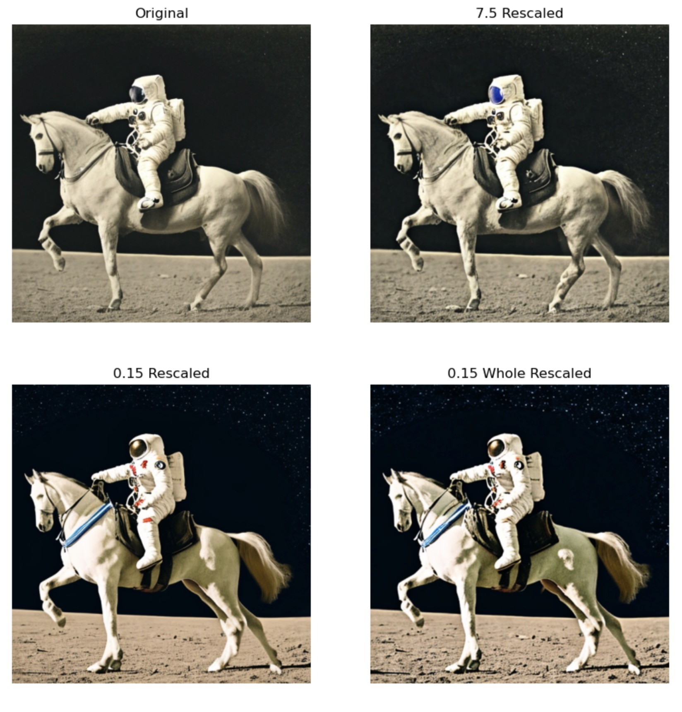

# Fast AI Experiments

These are experiments created while participating in [Jeremy Howards](https://twitter.com/jeremyphoward)'s absolutely terrific "[Practical Deep Learning for Coders: Part 2](https://itee.uq.edu.au/event/2022/practical-deep-learning-coders-uq-fastai-part-2)" course.

Here's a listing of what each notebook contains:

* **diff_edit**: Attempts to get the [DiffEdit](https://arxiv.org/abs/2210.11427) paper implemented. WIP.

* **guidance_variations**: Trying out various guidance value techniques discussed on the FastAI forums to compare and contrast each method to see which one works best (for a given value of "best").

  
  
* **mubert_music:** Generating music using the Mubert API and a text prompt. Also explores converting an image to a text description using BLIP/CLIP and then using that description as the prompt to pass on to generate music so that you essentially have an image-to-music pipeline ...

* **prompt_editing**: This one has experiments into how to edit elements of an image created using Stable Diffusion by passing the seed used for the original image, the original prompt, and a new edited prompt which contains the changes you want to implement. This is still a WIP since the concept worked  on the first try, but I'm not sure if that's a fluke or not ... Needs more testing.

  |                           |                             |
  | ------------------------------------------------------------ | ------------------------------------------------------------ |
  | **Original prompt:** "a cat riding a bicycle, highly detailed, trending on artstation, colorful" | **Edited prompt:** "a dog riding a bicycle, highly detailed, trending on artstation, colorful" |
  |                            |                          |
  | **Original:** "A chocolate cake, trending on artstation"     | **Edited:** "A strawberry cake, trending on artstation"      |
  |                                  |                    |
  | **Original:** "A fantasy forest, trending on artstation"     | **Edited:** "A fantasy forest in winter, trending on artstation" |
  
  Heres's a bunch of tests where the same prompt (which is the first image in the grid), is edited in various ways to get secondary images which are fairly similar to the first:
  
  

* **prompt_edit_image**: This is a variation on the prompt_edit example above which takes an image input and edits the image based on an input prompt. Sample output below:

  